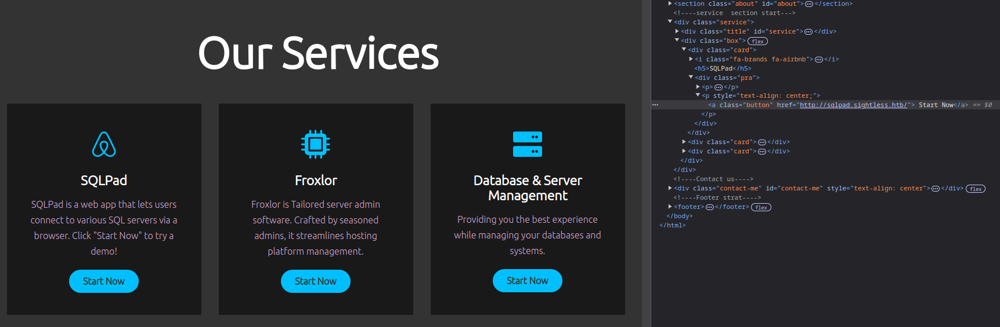

# Hack The Box: Sightless Machine Writeup

## Summary
This writeup covers the steps I took to complete the [Sightless](https://app.hackthebox.com/machines/Sightless) machine on [Hack The Box](https://app.hackthebox.com). The machine involved exploiting a SQLPad vulnerability, cracking a user hash, discovering hidden domains, and leveraging a Chrome debugging session to escalate privileges to root.

---

## Enumeration
### Nmap Scan
I started by running an `nmap` scan to identify open ports:
```bash
nmap -sC -sV <target-ip>
```
The scan revealed the following open ports:
- **21**: FTP
- **22**: SSH
- **80**: HTTP

### Web Exploration
Accessing port 80 redirected me to `sightless.htb`. I added this domain to my `/etc/hosts` file to access the website:
```bash
sudo echo "<target-ip> sightless.htb" >> /etc/hosts
```

I tried brute-forcing directories and virtual hosts using `ffuf`, but no significant results were found. However, exploring the web page revealed a link to `sqlpad.sightless.htb`, so I added this subdomain to `/etc/hosts` as well.



---

## Initial Foothold
### SQLPad Vulnerability
After some research, I found a known vulnerability in SQLPad [CVE-2022-0944](https://github.com/0xDTC/SQLPad-6.10.0-Exploit-CVE-2022-0944) that allowed me to spawn a reverse shell. Using this exploit, I gained access to the system, but I was inside a Docker container. Attempts to escape the container using known techniques were unsuccessful.


### Extracting User Credentials
Within the Docker container, I discovered the `/etc/shadow` file contained a hashed password for the user `michael`. I extracted the hash and cracked it using `hashcat`:


```bash
hashcat -m 1800 hash.txt rockyou.txt
```

After cracking the hash, I logged in as `michael` via SSH:
```bash
ssh michael@<target-ip>
```
This granted me access to the user's account, and I retrieved `user.txt`.

---

## Privilege Escalation
### Linpeas Enumeration
I uploaded `linpeas.sh` to the target machine and executed it to enumerate potential privilege escalation vectors. Linpeas revealed:
1. Several open ports on localhost, including **8080**.
 


2. A Chrome session with remote debugging enabled.


3. A reference to the domain `admin.sightless.htb` in Apache configuration files.


### Port Forwarding and Froxlor
To investigate the localhost services, I used SSH port forwarding:
```bash
ssh -L 8080:localhost:8080 michael@<target-ip>
```

Accessing `http://localhost:8080` presented a notice indicating the wrong domain. Using the Apache configuration information, I added `admin.sightless.htb` to the localhost line of my `/etc/hosts` file, revealing a [Froxlor](https://www.froxlor.org/) login page.


### Chrome Remote Debugging
Using the remote debugging feature, I forwarded Chrome's debugging port via SSH and connected it to my local browser:
```bash
ssh -L PORT:localhost:PORT michael@<target-ip>
```

I used Chrome DevTools to connect to the debugging interface and accessed the running session. Since the remote debugging flag was set to 0, the port is determined randomly. As there were multiple ports open on localhost, I tried each one until I got a debug session listed in my browser. From here, I captured the credentials for the Froxlor login.


### Froxlor Exploitation
After logging in to Froxlor, I searched online for potential vulnerabilities and found the following [post](https://sarperavci.com/Froxlor-Authenticated-RCE/). The vulnerability allows authenticated RCE as root, by changing the startup command of the `PHP-FPM` service. However, since this command is highly sanitized, it's better to have this command execute another script stored on the machine. I used this exploit to execute a script that made `/bin/bash` a SUID binary:
```bash
# On target machine
echo 'chmod +s /bin/bash' > /tmp/script.sh

# On PHP-FPM startup command
/bin/bash /tmp/script.sh
```
I then restarted the service to apply the changes.

### Root Shell
With the modified binary, I spawned a root shell:
```bash
bash -p
```
This granted me root access, and I retrieved `root.txt`.
